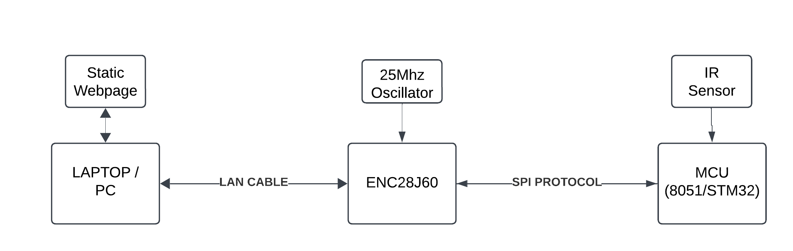
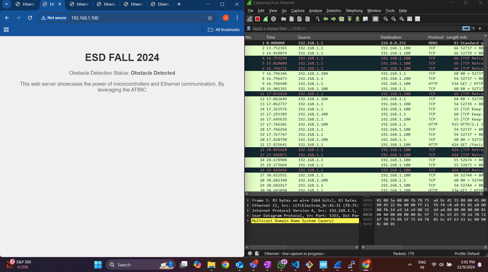

# Ethernet-Based Web Server for Embedded Systems

## Overview

This project demonstrates the implementation of an **Ethernet-based web server** using the **ENC28J60 Ethernet Controller** and an **8051-based microcontroller (AT89C51RC2)**. The microcontroller collects real-time sensor data and transmits it over Ethernet to a web page that displays the status.

The **primary goal** of this project was to gain hands-on experience with the **Ethernet (TCP/IP) protocol** and understand how embedded systems interact with networked applications.

## System Architecture

The system consists of the following components:

- **Microcontroller (AT89C51RC2)**: Reads sensor data.
- **Temperature Sensor**: Provides environmental data.
- **ENC28J60 Ethernet Module**: Acts as a SPI-to-Ethernet interface.
- **Web Page**: Displays real-time sensor status.
- **PC/Laptop**: Accesses the embedded web server via a browser.

Below is the **block diagram** of the system:

## Project Demonstration

The microcontroller establishes an **SPI-based** communication with the **ENC28J60 module**, which then serves a simple web page over **Ethernet**. The web page dynamically updates with real-time sensor readings.

The **captured packets in Wireshark** verify TCP/IP communication and HTTP requests between the embedded server and the client.

Screenshot of the **Web Page & Wireshark Analysis**:

## Features

✔️ Microcontroller-based web server  
✔️ SPI communication with ENC28J60  
✔️ Static HTML page served over Ethernet  
✔️ HTTP GET requests handled by the embedded system  
✔️ Real-time sensor data displayed on the web page  
✔️ Packet analysis via Wireshark  

## Future Enhancements

🔹 Implement dynamic web pages with AJAX for real-time updates  
🔹 Full integration on **8051** without relying on STM32 as a fallback  
🔹 Improve memory and speed optimization for embedded network handling  

## How to Run

1. Connect the **AT89C51RC2 microcontroller** with the **ENC28J60 Ethernet module**.
2. Power the system and ensure SPI communication is functioning.
3. Open a browser and enter the **IP address: `192.168.1.100`**.
4. The web page will display the **real-time sensor data**.
5. Use **Wireshark** to monitor network traffic and verify TCP/IP packets.

## Authors

👨‍💻 **Abhishek Nadgir**  
👨‍💻 **Abhishek Koppa**  
**Course:** ECEN 5613 - Embedded System Design  
📅 **Date:** December 15, 2024  

---
This project showcases **embedded web servers**, **SPI communication**, and **TCP/IP networking** using a microcontroller-based system. 🚀
